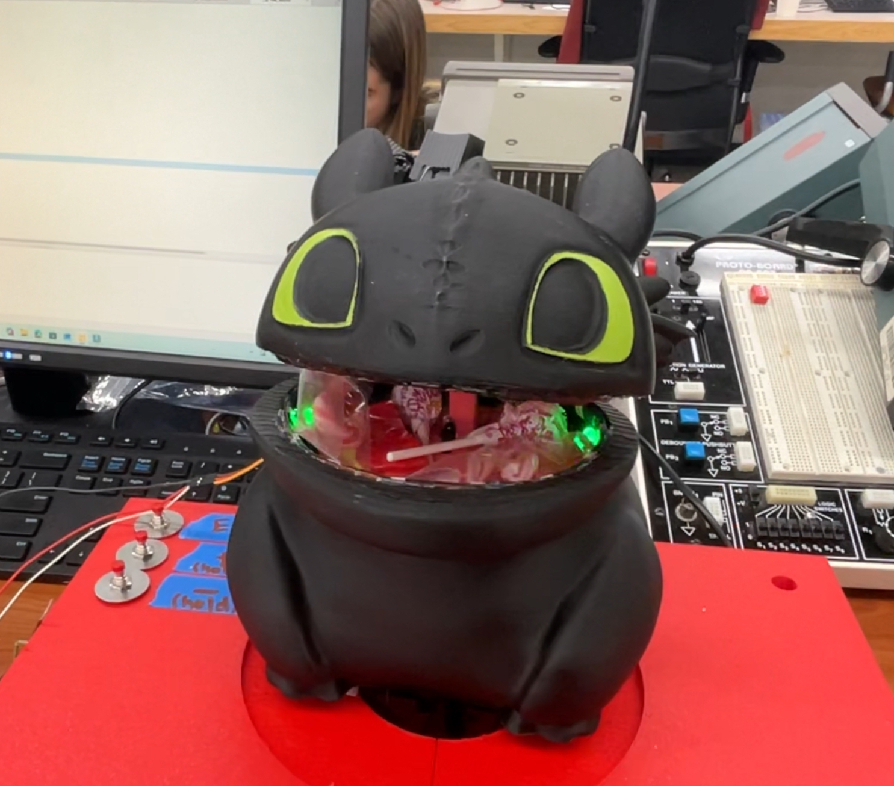
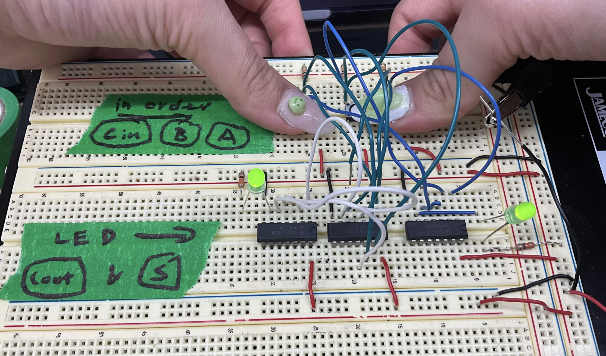
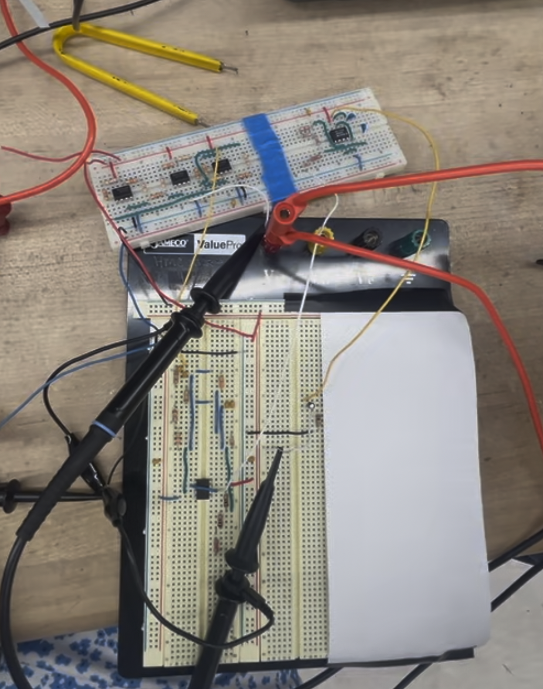
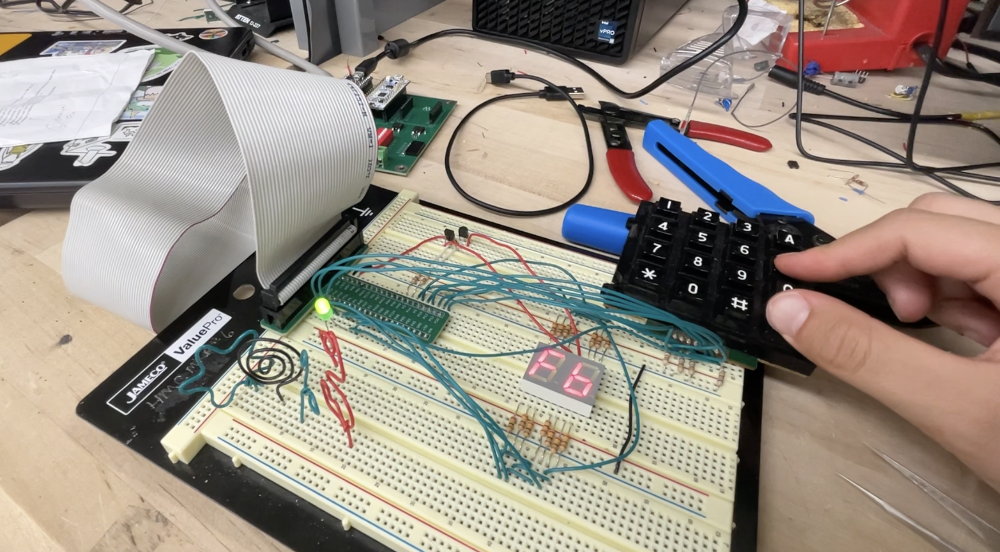
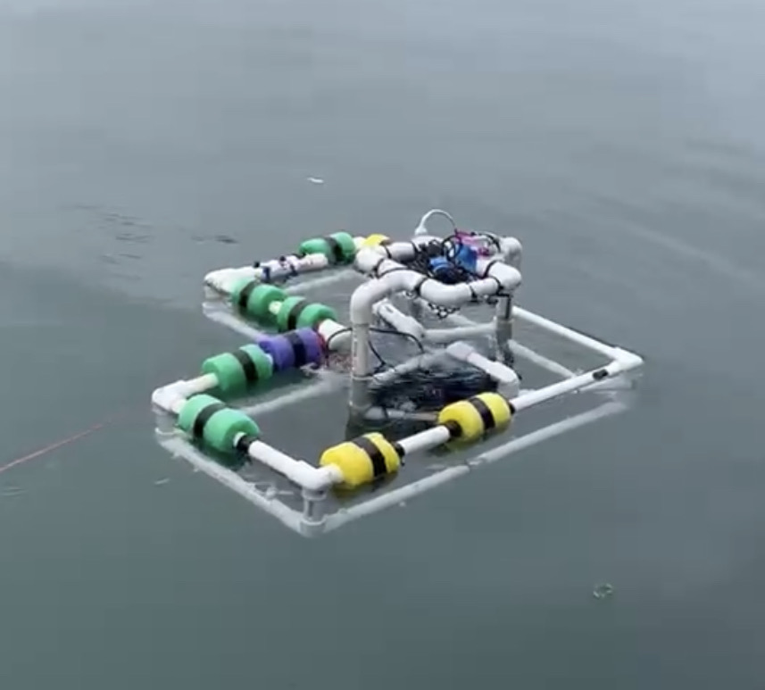
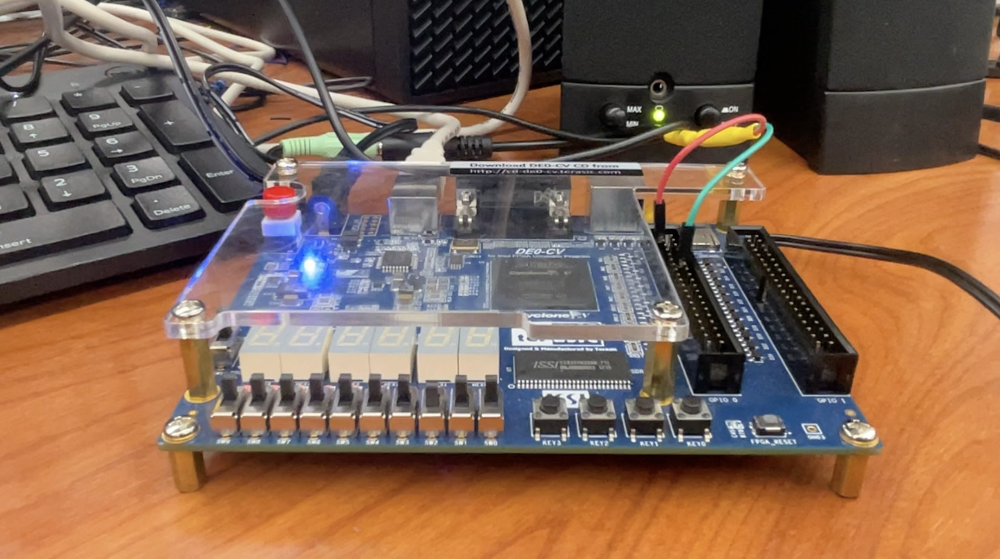

This page contains various projects that I've done from either on my own or from my classes: Microprocessor Systems: Design and Application, Experimental Engineering,and Electrical & Magnetic Circuits. These classes, respectively, led me to make projects like a Toothless Animatronic, an underwater robot equipped with sensors, and an Electrocardiogram (ECG).

**Click on the images for more details! [Some links in progress]**

**Animatronic Toothless Candy Bucket**   

**Full Adder Logic Circuit**   

**Electrocardiogram (ECG) Circuit**   

**Multiplexed 7-Segment Display**   

**Underwater Robot Project**   

**Frequency Design of a Music Keyboard**   

