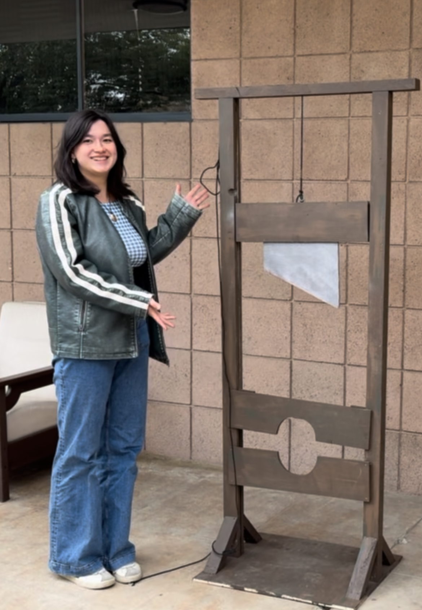
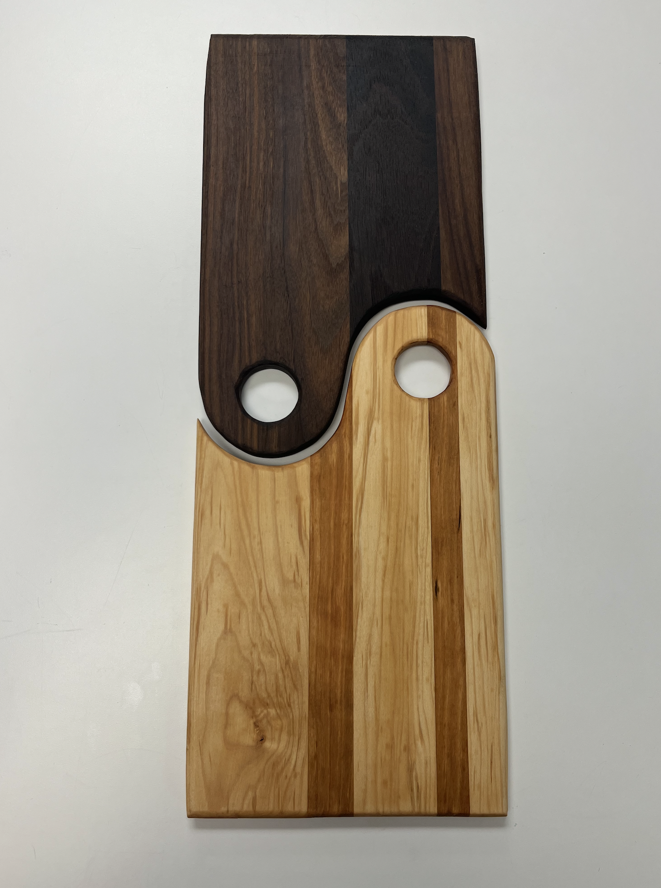
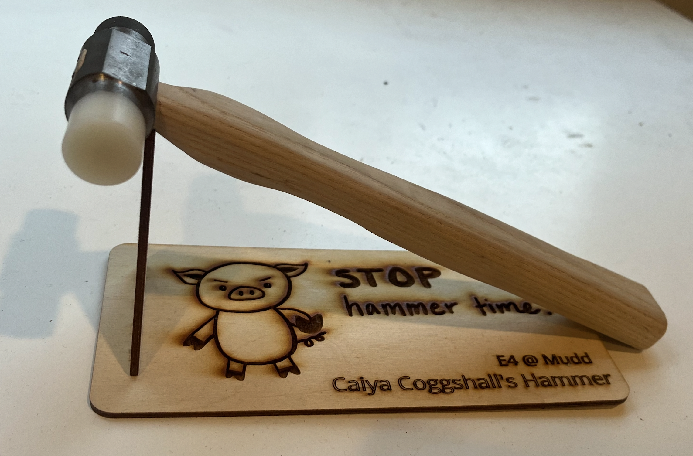
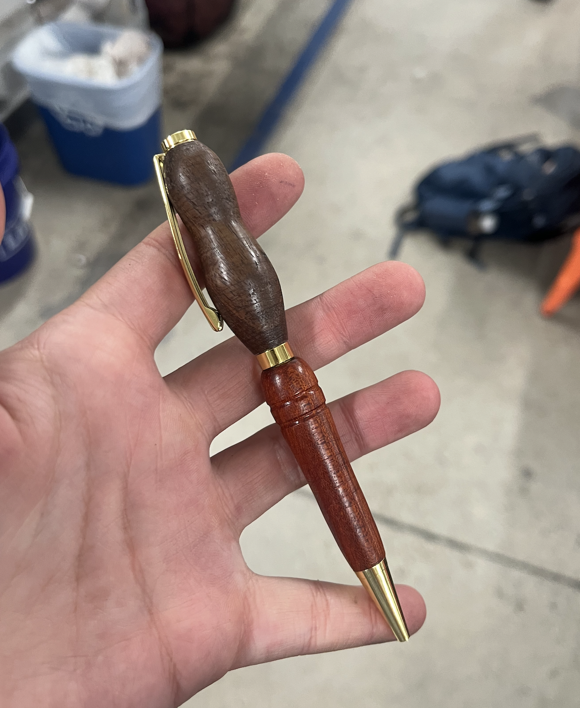
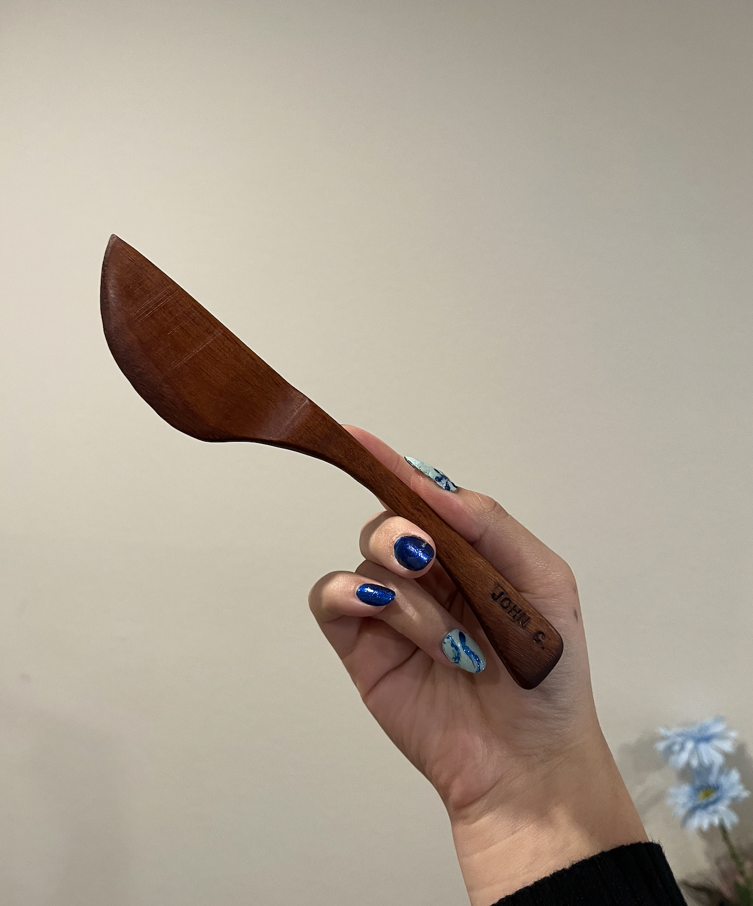
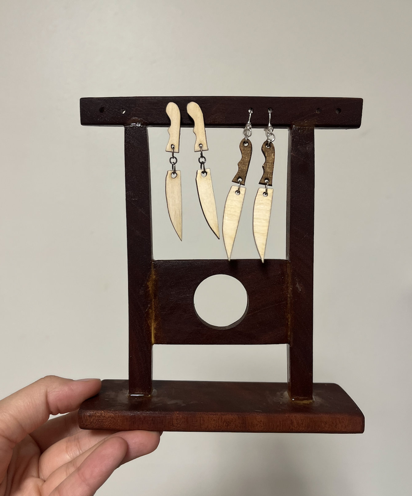
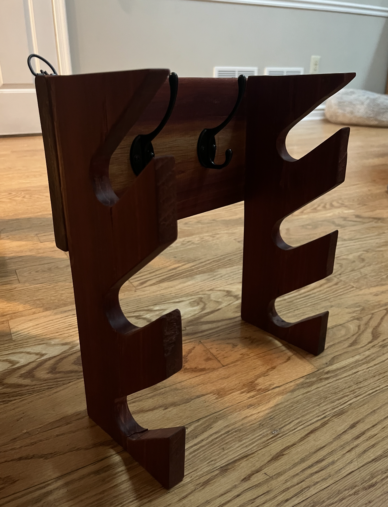
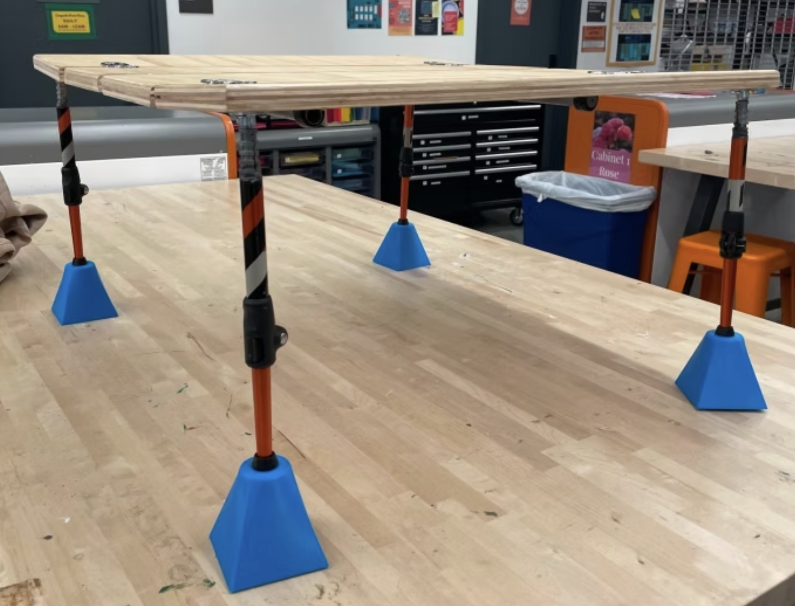
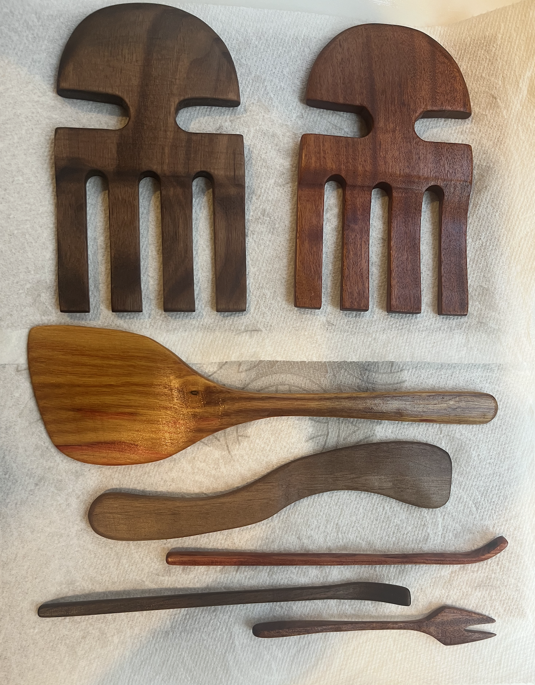

This page contains various projects that I've used mechanics principals to design and heavy machinery to make. Many of these are personal projects and is there area of engineering that I've fell in love with the most.

**Click on the images for more details! [Some links in progress]**

**6 Foot Functional Guillotine**   

**Ying and Yang Cutting Board**   

**Steel and Wood Hammer**   

**Wooden Lathe Spun Pen**   

**Engraved Knife Spreader**   

**Guillotine Earing Holder**   

**Hat Rack**   

**Portable Outdoor Table**   

**Various Spreaders**   

